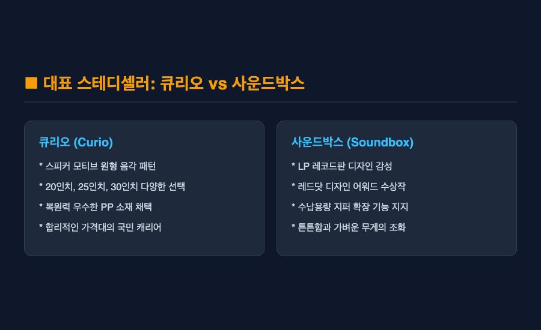

━━━
[제품 리뷰] 아메리칸 투어리스트 캐리어 추천 — 인기순 비교 분석
━━━

결론부터 말씀드리면 — 아메리칸 투어리스트 캐리어는 튼튼한 내구성과 독창적인 디자인, 그리고 합리적인 가격대까지 삼박자를 모두 갖춘 가장 실패 없는 선택입니다. 라인업별로 전면 개방이나 확장 지퍼 같은 특화 기능이 뚜렷하기 때문인데요.

솔직히 말씀드리면, 저도 처음 여행용 캐리어를 고를 때는 어떤 브랜드나 모델을 사야 할지 막막했습니다. 다 거기서 거기처럼 보이는 하드 캐리어 디자인에 굳이 인기 모델을 따져가며 사야 하나 싶은 통념도 있었거든요. 그런데 막상 직접 여러 모델을 비교해 보고 여행지에서 끌어보니, 바퀴의 부드러움이나 수납 방식에 따라 여행의 피로도가 완전히 달라진다는 점을 깨달았습니다.

웹 리서치 조사 결과와 함께 여행객들에게 가장 사랑받는 아메리칸 투어리스트 캐리어 인기 라인업 4종과, 구매 전 꼭 확인해야 할 실전 체크포인트까지 모두 정리해 보았습니다.

***

■ 첫 번째, 스테디셀러 큐리오와 사운드박스의 매력

아메리칸 투어리스트에서 가장 먼저 언급되는 대표 라인업은 단연 큐리오(Curio)와 사운드박스(Soundbox)입니다.

큐리오는 원형 음각 패턴의 독특한 시그니처 디자인으로 인기가 높으며, 20인치 기내용부터 30인치 대형까지 다양한 크기로 출시되어 커플이나 가족 여행용으로 인기가 많습니다. 사운드박스는 LP 레코드판 모티브 디자인으로 레드닷 어워드를 수상했을 만큼 뛰어난 감성을 자랑하는데요. 가벼운 복원력의 PP 소재를 사용하여 장거리 여행 시에도 짐을 안전하게 보호해 주는 장점이 있습니다.

다만 PP 소재 특성상 사용하다 보면 표면에 미세한 흠집이나 스크래치가 비교적 잘 눈에 띌 수 있다는 아쉬움은 참고해 두는 것이 좋습니다.

***

■ 두 번째, 비즈니스 및 편의성을 잡은 프론텍과 벨톤

최근 실용성을 중시하는 여행객 사이에서 급부상한 모델은 프론텍(Frontec)과 벨톤(Velton)입니다.

프론텍은 캐리어를 눕히지 않고 세운 상태에서 전면부 포켓을 열 수 있는 프론트 오프닝 방식을 채택했습니다. 이동 중이나 공항에서 노트북, 서류, 세면도구를 즉시 꺼낼 수 있어 출장용이나 짐 정리가 자주 필요한 분들에게 압도적인 편의성을 제공합니다. 벨톤은 스포티하고 모던한 느낌에 체계적인 내부 분리 포켓을 갖추어 활동적인 여행자들에게 사랑받고 있습니다.

***

■ 세 번째, 여행 일정에 맞는 인치별 규격 선택법

캐리어를 고를 때 디자인만큼 중요한 것은 내 여행 일정에 딱 맞는 규격 인치를 선택하는 일입니다.

1박 2일이나 2박 3일의 짧은 주말여행에는 20인치 기내용이 적합하며, 3박 5일이나 4박 6일 수준의 일반적인 해외여행에는 24인치 또는 25인치 화물용이 가장 이상적인 표준 규격입니다. 1주일 이상의 장기 체류나 가족 단위의 짐을 하나로 합칠 때는 28인치 이상을 선택하시는 것을 권해 드립니다.

***

■ 네 번째, 확장 지퍼와 스토퍼 휠의 실전 유용성

실제 여행지에서 캐리어의 가치를 결정짓는 핵심은 수납 확장 지퍼와 바퀴 제어 장치입니다.

여행지에서 쇼핑이나 기념품 구매로 짐이 늘어났을 때 확장 지퍼를 열면 수납용량이 최대 20퍼센트 이상 늘어나 매우 유용한데요. 더불어 프론텍이나 최신 라인업에 탑재된 스토퍼 휠(Stopper Wheel)은 대중교통 탑승 시 버튼 하나로 바퀴를 고정하여 캐리어가 스스로 미끄러지는 현상을 막아줍니다.

다만 확장 지퍼를 최대치로 열었을 경우 캐리어의 두께가 두꺼워져 일부 저비용 항공사(LCC)의 위탁수하물 크기 제한에 걸릴 수 있다는 주의점은 미리 확인하셔야 합니다.

***

■ 다섯 번째, 소재별 특징과 구매 시 아쉬운 점

하드 캐리어는 크게 PP(폴리프로필렌)와 PC(폴리카보네이트) 소재로 나뉩니다.

PP 소재는 충격 흡수력이 좋고 가벼워 깨질 위험이 적은 반면, PC 소재는 표면 강도가 높아 기스에 강한 편인데요. 아메리칸 투어리스트 지퍼형 모델들은 대부분 무게가 가볍고 확장이 용이하지만, 프레임형 캐리어에 비해서는 칼이나 날카로운 도구에 대한 보안성이 상대적으로 약할 수 있습니다. 따라서 해외 출국 전 TSA 잠금장치 설정 여부를 반드시 체크하시는 것이 좋습니다.

***

"여행의 시작과 끝을 함께하는 가장 든든하고 스타일리시한 동반자 — 아메리칸 투어리스트 캐리어."

새로운 여행을 앞두고 캐리어 구매를 고민 중이시라면, 본인의 여행 스타일과 필요한 특화 기능(전면 개방, 스토퍼 휠, 확장성)을 고려하여 아메리칸 투어리스트 캐리어를 직접 선택해 보시길 권해 드립니다. 처음에는 어떤 라인업을 사야 할지 다소 헷갈릴 수 있지만, 내게 딱 맞는 모델을 끌고 공항으로 향하는 순간 이전과는 다른 가벼운 발걸음을 경험하게 될 테니까요.

━━━

#아메리칸투어리스트 #캐리어추천 #여행용캐리어 #아메리칸투어리스트큐리오 #사운드박스 #프론텍캐리어 #캐리어사이즈 #24인치캐리어
