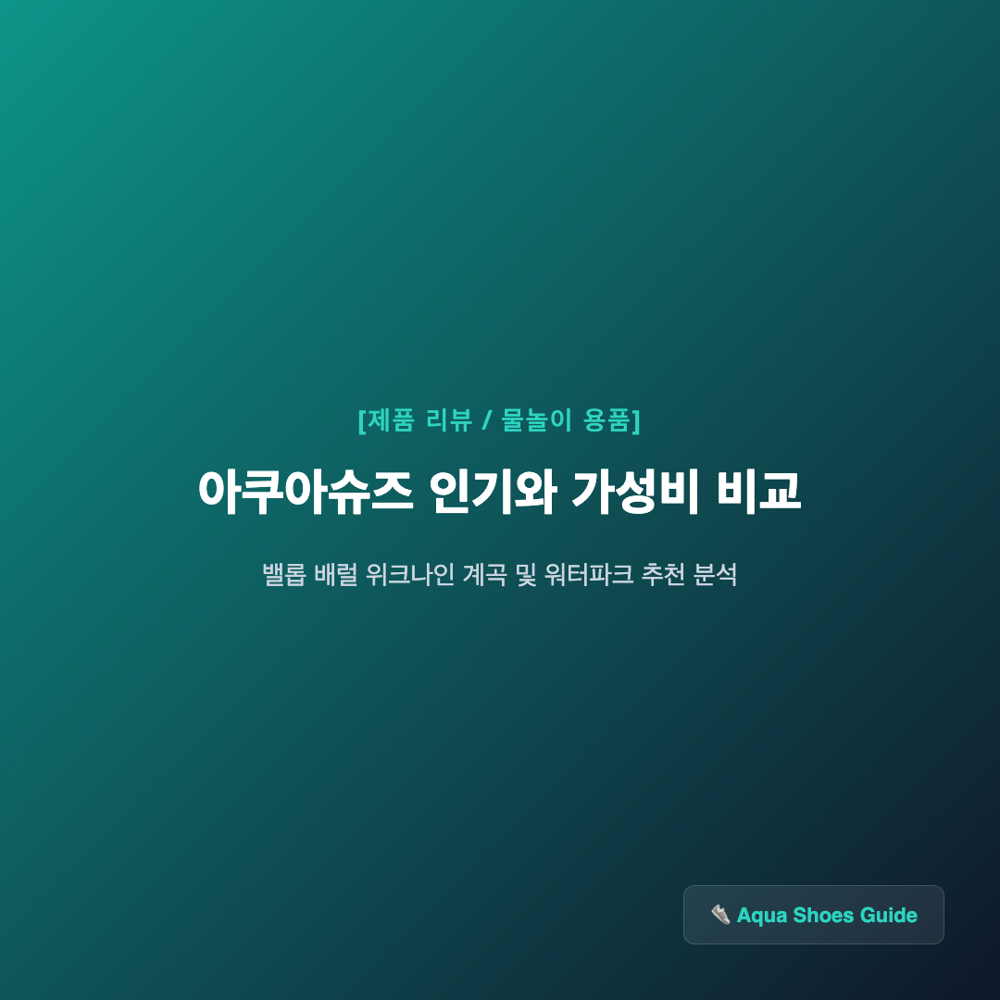
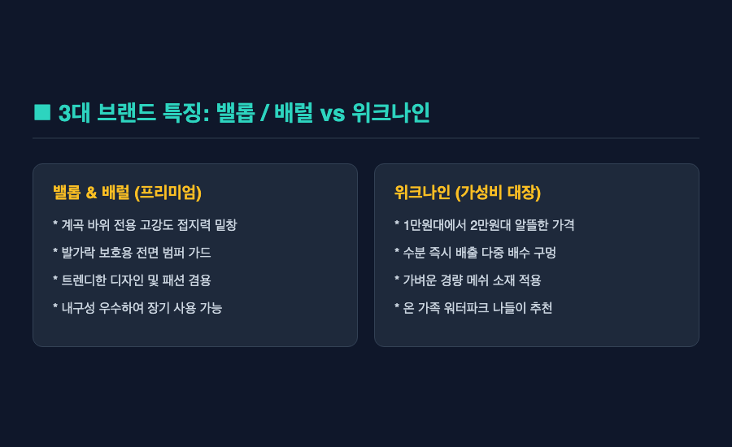
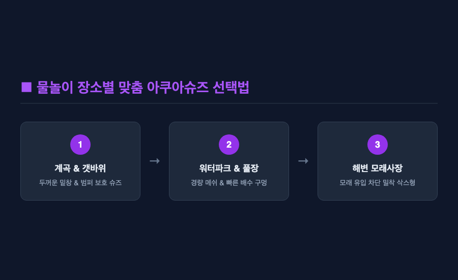
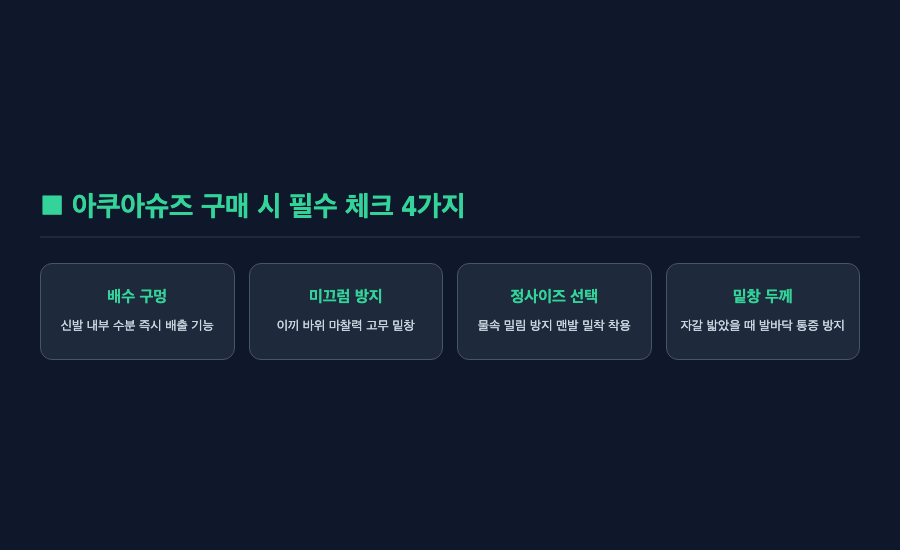
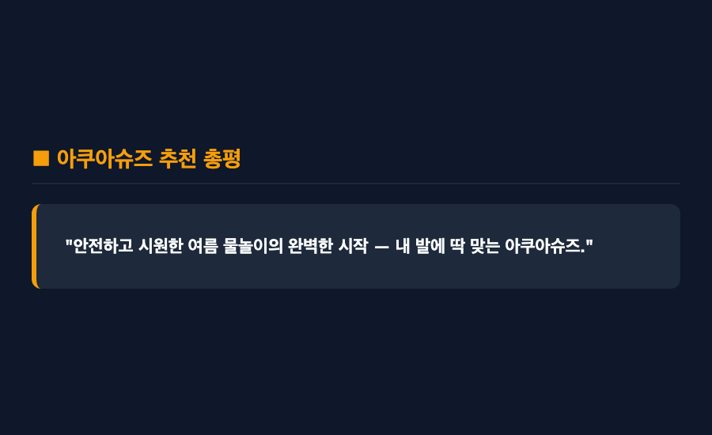

━━━
[제품 리뷰] 아쿠아슈즈 인기와 가성비 비교 분석 — 실패 없는 물놀이 신발
━━━

결론부터 말씀드리면 — 아쿠아슈즈는 단순히 디자인만 보고 살 것이 아니라, 계곡이나 워터파크 등 내가 방문할 물놀이 장소에 맞춰 미끄럼 방지 접지력과 배수 기능을 비교해 보고 골라야 합니다. 장소에 맞는 올바른 제품 선택이 부상을 막아주기 때문인데요.

솔직히 말씀드리면, 저도 처음 아쿠아슈즈를 구매할 때는 물놀이할 때 한두 번 신는 소모품인데 굳이 브랜드나 기능을 비교해 가며 사야 하나 싶은 생각이 들었습니다. 다이소나 저렴한 양말형 슈즈 아무거나 사면 그만이라는 통념이 있었거든요. 그런데 막상 자갈이 험한 계곡에 갔을 때 발바닥이 아프고 이끼에 미끄러지는 아찔한 경험을 하고 나서는, 내 발을 보호해 주는 신발의 기능성이 얼마나 중요한지 절실히 깨달았습니다.

웹 리서치 조사 결과와 함께 가장 인기 있는 아쿠아슈즈 브랜드 3종 비교 분석, 그리고 실패 없는 가성비 구매 꿀팁까지 모두 정리해 보았습니다.

***

■ 첫 번째, 브랜드별 대표 특징과 성능 비교

현재 국내 물놀이 시장에서 가장 높은 인지도를 자랑하는 브랜드는 밸롭(Ballop), 배럴(Barrel), 위크나인(Weeknine)입니다.

밸롭은 고강도 러버 밑창과 튼튼한 범퍼를 탑재하여 계곡이나 돌밭에서도 발을 완벽하게 보호해 주는 접지력 대장 브랜드입니다. 배럴은 워터 스포츠 전문 브랜드답게 세련된 스타일과 인체공학적 핏감을 자랑하여 휴양지 패션용으로 인기가 높으며, 위크나인은 1만원대에서 2만원대의 압도적인 가성비와 빠른 배수 홀을 갖추어 온 가족용으로 부담 없이 선택하기 좋습니다.

다만 고급형 브랜드 제품은 가성비 모델 대비 가격대가 다소 높게 책정되어 있어, 일 년에 한두 번만 물놀이를 가는 분들에게는 약간의 가격 부담이 느껴질 수 있습니다.

***

■ 두 번째, 계곡과 워터파크 장소별 맞춤 선택법

아쿠아슈즈를 고를 때는 내가 주로 어디서 신을 것인지를 가장 먼저 고려해야 합니다.

바위와 이끼가 많은 계곡에서는 밑창이 두껍고 발가락 부상을 막아주는 범퍼가 있는 슈즈형(밸롭 등)을 권해 드립니다. 반면 바닥이 콘크리트나 타일로 이루어진 워터파크나 수영장에서는 무겁지 않고 배수가 빠른 메쉬 타입이나 가벼운 가성비 슈즈(위크나인 등)가 훨씬 편안합니다.

***

■ 세 번째, 배수 구멍과 미끄럼 방지 밑창의 중요성

물속에서 신는 신발인 만큼 수분 배출과 밑창 접지력은 핵심 요소입니다.

신발 밑창에 배수 홀(Drainage Hole)이 잘 뚫려있어야 물 밖으로 나왔을 때 신발 안에 물이 고이지 않고 즉시 빠져나가 발이 묵직해지는 현상을 막을 수 있는데요. 또한 지면과 마찰력을 높여주는 특수 고무 패턴 밑창은 미끄러운 타일이나 바위 위에서 넘어지는 위험을 획기적으로 줄여줍니다.

***

■ 네 번째, 사이즈 선택 시 실전 주의사항

아쿠아슈즈를 구매할 때 가장 흔히 하는 실수는 평소 운동화처럼 여유 있게 사이즈를 선택하는 것입니다.

아쿠아슈즈는 물에 들어가면 소재가 연해지면서 헐거워지는 경향이 있는데요. 신발이 발에 딱 맞지 않고 안에서 놀면 물속에서 쉽게 벗겨지거나 오히려 발목을 띌 수 있어 위험합니다. 따라서 여유를 두지 마시고 맨발에 착 밀착되는 정사이즈를 선택하시는 것이 가장 안전합니다.

***

■ 다섯 번째, 가성비 제품 구매 시 아쉬운 점

1만원 미만의 초저가 얇은 삭스형 아쿠아슈즈는 가볍고 휴대하기 편하다는 장점이 있습니다.

하지만 밑창이 지나치게 얇아 뾰족한 자갈이나 돌을 밟았을 때 발바닥 통증이 그대로 전달되고, 내구성이 약해 한 시즌만 신어도 구멍이 나는 아쉬운 한계가 존재하는데요. 따라서 험한 계곡이나 장시간 활동을 계획하신다면 최소한 1만원대 중반 이상의 밑창이 보강된 제품을 고르시는 것이 훨씬 합리적입니다.

***

"안전하고 시원한 여름 물놀이의 완벽한 시작 — 내 발에 딱 맞는 아쿠아슈즈."

올여름 물놀이를 앞두고 계신다면, 내가 갈 장소에 맞는 기능성과 가성비를 꼭 비교해 보고 스마트하게 아쿠아슈즈를 준비해 보시길 권해 드립니다. 작은 신발 하나만 잘 챙겨도 물놀이 내내 발 아픔이나 미끄러짐 걱정 없이 마음껏 피서를 즐기실 수 있을 테니까요.

━━━

#아쿠아슈즈 #아쿠아슈즈추천 #아쿠아슈즈가성비 #밸롭아쿠아슈즈 #배럴아쿠아슈즈 #위크나인 #계곡아쿠아슈즈 #워터파크신발
