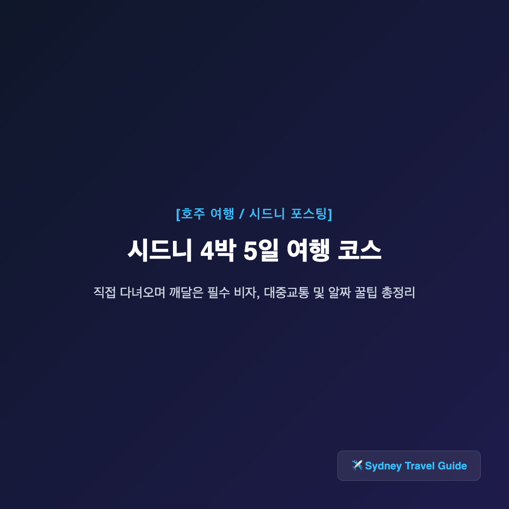
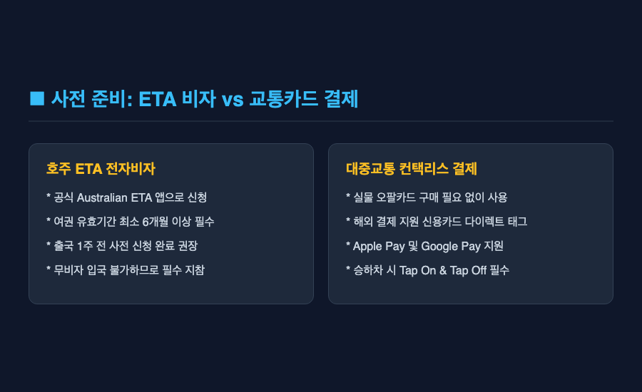
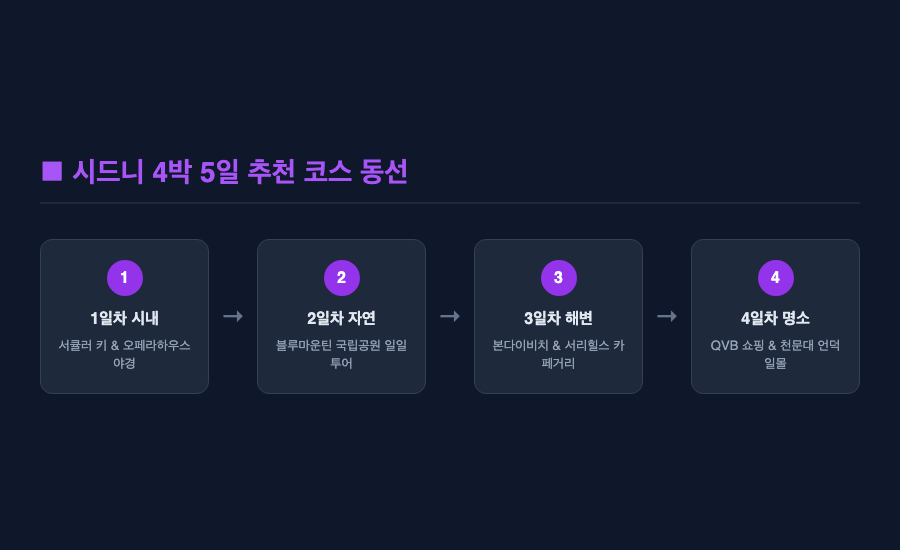
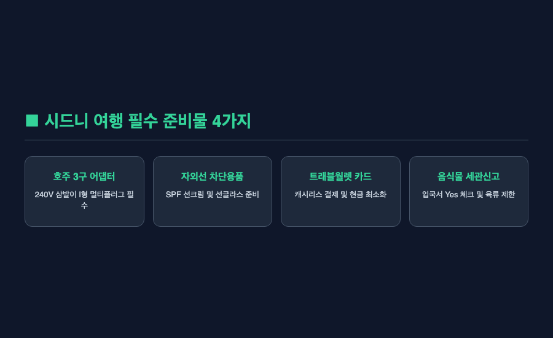
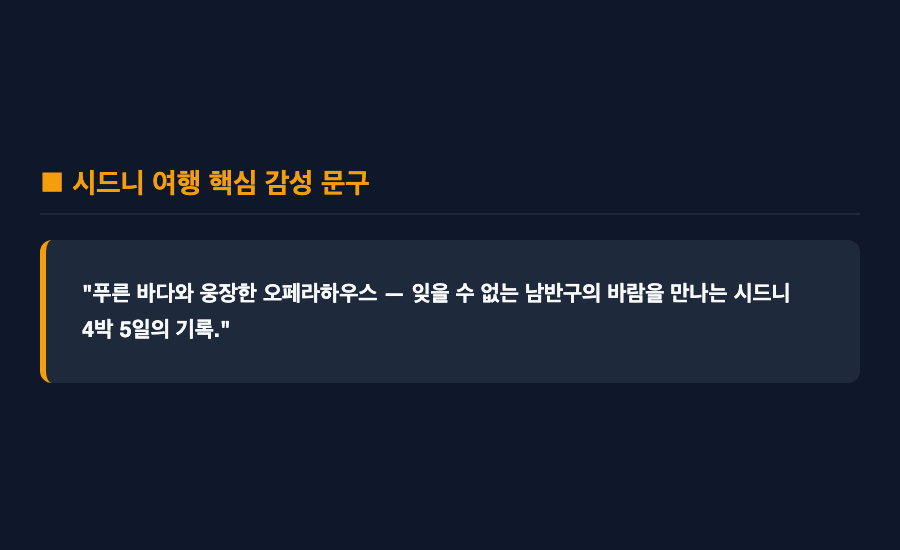

━━━
[여행] 시드니 4박 5일 여행 코스 — 직접 다녀오며 깨달은 알짜 꿀팁
━━━

결론부터 말씀드리면 — 시드니 4박 5일 여행은 도심의 모던함과 남반구의 웅장한 대자연을 동시에 경험할 수 있는 가장 완벽한 일정입니다. 사전 비자 발급과 교통카드 준비만 잘 해두면 동선 이동도 매우 쉽기 때문인데요.

솔직히 말씀드리면, 저도 처음 호주 여행을 계획했을 때는 걱정이 앞섰습니다. 비자 신청 절차도 낯설고, 챙겨야 할 세관 규칙이나 현지 교통 편의성이 어떨지 감이 잡히지 않았거든요. 무비자 입국이 당연할 거라는 생각도 일종의 통념이었으니까요. 그런데 막상 직접 준비하고 다녀와 보니, 몇 가지 핵심 포인트만 미리 챙기면 이보다 편하고 매력적인 휴양지가 없다는 것을 깨달았습니다.

웹 리서치 조사 결과와 함께 제가 직접 다녀오며 느꼈던 시드니 4박 5일 알짜 여행 코스, 그리고 필수 준비물과 솔직한 주의사항까지 모두 정리해 보았습니다.

***

■ 첫 번째, 사전 비자 발급과 대중교통 이용법

호주 여행 시 가장 먼저 챙겨야 하는 것은 전자여행허가(ETA) 비자입니다. 무비자 입국이 불가하므로 출국 최소 1주 전에는 스마트폰의 Australian ETA 공식 앱을 이용해 비자를 신청해 두어야 하는데요.

현지 대중교통은 오팔(Opal) 카드를 사용하는 것이 기본이지만, 굳이 실물 카드를 사지 않아도 해외 결제가 가능한 비접촉식 신용카드나 Apple Pay를 그대로 태그하여 이용할 수 있습니다. 승하차 시 단말기에 태그(Tap On & Tap Off)만 잘 지켜주면 트레인, 버스, 페리까지 손쉽게 이용 가능한 것입니다.

다만 공항에서 시내로 이동하는 공항철도의 경우 별도의 추가 통행료가 붙어 요금이 다소 비싼 편인데요. 일행이 2인 이상이라면 우버나 택시를 이용하는 것이 오히려 비용을 절약할 수 있다는 아쉬운 점은 참고할 필요가 있습니다.

***

■ 두 번째, 시드니 4박 5일 추천 여행 코스 동선

4박 5일이라는 기간은 시드니의 핵심 명소와 근교 대자연을 균형 있게 둘러보기에 딱 좋은 시간입니다.

첫날은 서큘러 키와 오페라하우스, 하버브릿지 주변을 걸으며 시드니의 랜드마크 분위기를 익히고, 둘째 날은 대자연 블루마운틴 국립공원 투어로 웅장한 삼림을 감상합니다. 셋째 날은 본다이 비치 해변 산책과 코스탈 워크를 즐긴 뒤 서리힐스 카페거리를 방문하고, 넷째 날은 QVB 쇼핑과 달링하버 야경을 즐긴 후 마지막 날 시드니 천문대언덕 피크닉으로 여정을 마무리하는 동선을 권해 드립니다.

다만 2일차에 방문하는 블루마운틴은 산악 지대 특성상 갑자기 짙은 안개가 끼는 날이 있는데요. 날씨 변수가 존재하므로 현지 일기예보를 미리 체크하여 투어 순서를 유연하게 변경해 주는 센스가 필요합니다.

***

■ 세 번째, 현지 자외선 및 전압 어댑터 준비물

시드니 여행을 떠나기 전 짐을 싸면서 반드시 챙겨야 하는 실전 준비물이 있습니다.

첫 번째는 호주 전용 삼발이 3구 형태(I형) 멀티 어댑터입니다. 한국과 전압 규격이 달라 변환 어댑터 없이는 스마트폰 충전이 불가능하기 때문인데요. 두 번째는 높은 자외선 차단 지수의 선글라스와 선크림입니다. 남반구의 햇살은 생각보다 강렬해서 잠시만 방심해도 피부가 타버리기 십상입니다.

추가로 수질에 민감한 편이시라면 휴대용 샤워기 필터를 하나 챙겨가시는 것도 좋은 방법인데요. 숙소 환경에 따라 수질 차이를 느낄 수도 있기 때문입니다.

***

■ 네 번째, 캐시리스 결제 문화와 세관 신고 주의사항

현재 시드니 현지는 현금을 거의 쓰지 않는 '캐시리스(Cashless)' 결제 문화가 완전히 정착되어 있습니다.

식당, 카페, 대중교통까지 트래블월렛이나 트래블로그 카드로 대부분 해결되므로 비상용 현금은 100달러 내외로 최소화하여 환전하시는 것이 훨씬 편리합니다. 또한 호주는 음식물 반입에 대한 세관 검사가 매우 까다로운 나라인데요. 컵라면이나 간식을 가져가실 때는 입국 신고서의 음식물 항목에 반드시 'Yes'로 체크하시고, 육류 성분이 들어간 식품은 반입을 자제하셔야 합니다.

***

■ 다섯 번째, 공항 이동 및 날씨 변수 대비 꿀팁

여행의 만족도를 높여주는 소소하지만 중요한 현지 꿀팁도 빼놓을 수 없습니다.

시드니 천문대 언덕은 해 질 무렵 일몰을 감상하며 돗자리를 펴고 피크닉을 즐기기에 가장 인상적인 장소인데요. 다만 일몰 시각에는 바람이 다소 쌀쌀하게 불 수 있으므로 걸칠 수 있는 가벼운 외투를 챙겨가시길 권해 드립니다. 현지 상점들이 생각보다 일찍 문을 닫는 편이어서 쇼핑이나 일정을 조금 서둘러 진행해야 하는 아쉬움도 고려해 두는 것이 좋습니다.

***

"푸른 바다와 웅장한 오페라하우스 — 잊을 수 없는 남반구의 바람을 만나는 시드니 4박 5일의 기록."

답답한 일상에서 벗어나 완벽한 휴식과 활력을 찾고 싶으시다면, 호주 시드니 여행을 꼭 다녀오시길 권해 드립니다. 비자 신청부터 짐 싸기까지 처음에는 챙길 게 많아 보일 수 있는데요. 하지만 막상 오페라하우스 노을 앞에 서는 순간, 오길 정말 잘했다는 깊은 감동을 느끼게 될 테니까요.

━━━

#시드니여행 #시드니4박5일 #호주여행준비 #시드니여행코스 #오팔카드 #호주비자ETA #블루마운틴 #시드니꿀팁
